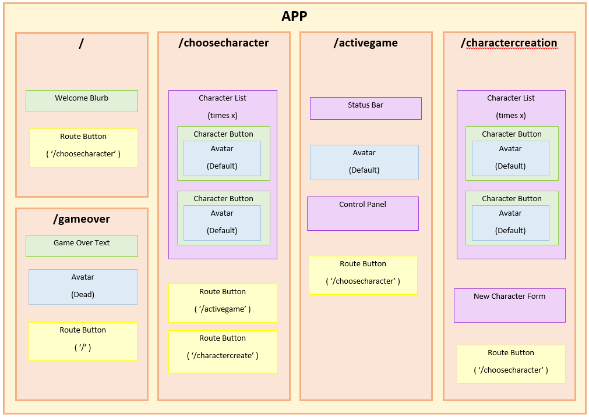

# _React Tamagotchi_

#### _A Remake of the Classic Toy, 11/16/18_

#### By _**Luke Vandekieft**_

## Description

_The Tamagotchi is the second best example of a fad toy, narrowly beating out the Fidget Spinner in that it has three times the number of interactive elements. This virtual pet likes to eat, sleep, and play just like the rest of us! Come relive your childhood (or adulthood, no judgment) with this lovely interactive game!_

_Once basic functionality for this game was reached I started considering ways to use it as a React Guinea Pig. Can we have multiple characters? Can we have state exist on one component but reserve intervals for a child component? Can CRUD for new characters be implemented in a non-awkward way? Some aspects of this game may seem counterintuitive but it's been a great project for learning how React reacts to itself. Below you can review the component flow chart for an overview of the structure or the developer notes to see what I've attempted to accomplish in continuing beyond the basics._

## Setup/Installation Requirements

_Live site is at https://lukevandekieft.github.io/react-tamagotchi_
 
 

_To download & edit do the following:_

* _Get file from Github._

      $ git clone https://github.com/lukevandekieft/react-tamagotchi.git

* _Install NPM (node package manager) as needed - instructions can be found at https://www.npmjs.com/get-npm ._

* _Install necessary webpack dependencies for project._

      $ npm install

* _Compile and open webpage in developer mode._

      $ npm run start

## Development Notes

* _I'd like to use a React-equivalent of Angular's ngIf to display Character Select icons rather than the hard-coded set I have. Can I use an object .map equivalent? Character buttons would then need to become a component._
* _How can I implement CRUD into this project? I'd like to set up a character create section with a handful of pre-selected images. How hard is that to do? Now to find out!_
* _Routing in this website is non-ideal due to the current dependency on having a "Current Character" feature. You can currently select "Play" on character select without selecting a character and if you refresh on Active Game the screen is broken. I'd like to hide "Play" with an if statement and also fix routing so that it always sends you to the root / path upon refresh._
  * _UPDATE: history functions appear to either use the deprecated componentWillMount function or Redux which we're learning next week. After an hour of trying I'm shelving this for next week._
* _Sass in React would be awesome. Is that attainable today?_

_DONE:_
* _Removed redundant CSS, consolidated redundant functions, and created components for reused assets._

## Bugs and Issues

* _RouteButtons currently fire the optional props.onResetGame function whenever they're clicked. This causes no discernable errors but clogs up the console log. Should I pass a dummy function or is there a better way to fix this?

## Technologies Used

* _React Library_
* _HTML_
* _JavaScript_
* _JSX_
* _Webpack_

## Support and contact details

_If you have any concerns or suggestions please contact Luke Vandekieft at vandekie@gmail.com_

### License

*This software is licensed under the MIT License.*

Copyright (c) 2018 **_Luke Vandekieft_**
